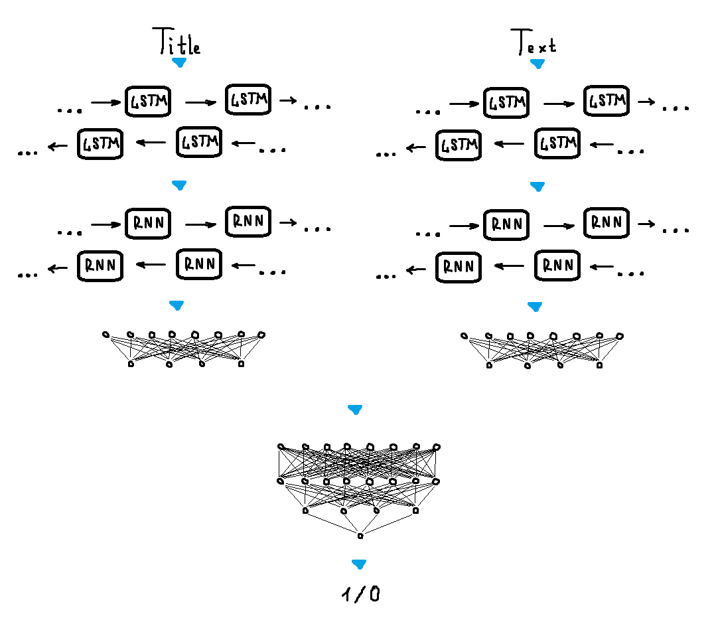

# Fake/Real News Classification

This project involves developing a machine learning model
to distinguish between real and fake news using natural language processing (NLP) techniques.
The Jupyter notebook outlines the steps taken to
preprocess data, build, train, and evaluate a neural network model for this classification task.

The data was obtained from: `https://www.kaggle.com/datasets/clmentbisaillon/fake-and-real-news-dataset`

## Dataset

Columns:
- title
- text
- subject
- date

The "subject" and "date" columns were removed from the data.
The "subject" column was removed due to differences in subjects for Fake and True news.

## Steps

1. Tokenizing the data and ensuring each title and text are the same length.
(title's and text's desired lengths were based on the maximum sizes of title and text.
2. Creating a TensorFlow dataset and dividing it into training, validation, and test datasets.
3. Creating a model and training it.
4. Evaluating its performance.

## Model

The model was chosen to have two inputs so that the algorithm could
learn how to extract the necessary information about news from the title and text separately.

Performance on the test dataset:

    Loss: 0.0012
    Accuracy: 0.9995
    Precision: 1.0000
    Recall: 0.9989
